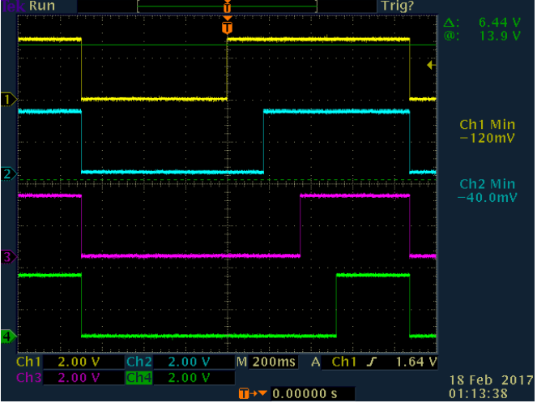
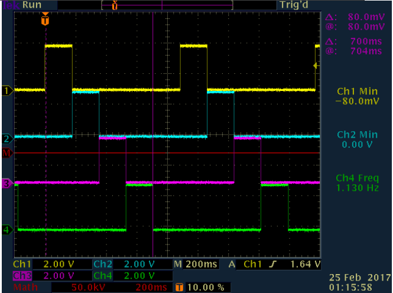

Lab 04: Programming for GPIO Port of STM32F4xx 
==============================================

# Objective
The objective of this lab is to learn the general-purpose inputs and outputs of the microcontroller STM32F4xx. 

# Tasks:
-	Test the demo project IO_Toggle in C language
-	Test the assembly program for GPIOs
-	Modify the assembly program to control LEDs.
-	Measure the waveforms of the LED control signals with an Oscilloscope

# Procedure

1.	Test the demo project IO_Toggle in C language
In IAR EWARM IDE”: File -> Open -> Workspace…
You can find the workspace for the target project IO_Toggle in the folder:  
..\Documents\stsw-stm32068\STM32F4-Discovery_FW_V1.1.0\Project \Peripheral_Examples\IO_Toggle\EWARM 
Rebuild the project, download and debug the demo project. When the program runs properly, you should see the four LEDs turned on and off in sequence. The four LEDs are controlled with GPIOs: PD12, PD13, PD14 and PD15. Using four probes of the oscilloscope in the lab to detect the GPIOs output signals, including the output waveforms, voltage magnitude (VOL and VOH) for logic 0 and logic 1, the delay time for updating the LED status. Fill Table I below.

Table I

| GPIO Number   | VOL (Volts)  |VOH (Volts)  | Delay Time (s) |
| :------------ | -----------: | ----------: | :------------: |
| PD12(Y)       | -120mV       | 3.08V       |  700 ms        |
| PD13(B)       | -80mV        | 3.12V       |  872 ms        |
| PD14(P)       | -80mV        | 3.08V       |  1.04 s        |
| PD15(G)       | -160mV       | 3.04V       |  1.22 s        |

**Draw the waveforms of GPIO outputs below:**

- PD12(yellow)
- PD13(Blue)
- PD14(Pink)
- PD15(Green)

 
2.	Test the assembly program for GPIOs
Open the Workspace for the assembly program build in Lab02. Remove the assembly modules asm011.asm and sintable.asm from the project. Add the provided assembly source code file asm010.asm in the project.
Rebuild the project, download and debug the project. You should see the similar operation of the GPIOs controlling LEDs like the demo project IO_Toggle.
 
3.	Understand the assembly program to control LEDs
Study the source code of the assembly program asm010.asm for programming GPIOs. Find the addresses of the registers of GPIO Port D listed in Table II. Find the values written to port mode register and output type register and fill Table II. 

Table II

|Registor of GPIOD port D   | Address(Hex)  | Written Value(Hex) |
| :------------------------ | ------------: | :----------------: |
| Port mode register        | 0x40020C00    |  0x55000000        |
| Output type register      | 0x40020C04    |  0x00000000        |
| Output data register      | 0x40020C14    |                    |

	
In the assembly program asm010.asm, the constant count is for setting the delay time for updating the LED status. Changing the value of the constant so that the delay time is equal to measured one in the demo project IO_Toggle. You setting value: 

**count = 0x000729AD**

4.	Modify the assembly program to control LEDs
Modify the assembly source program so that only one LED is turned on after each output updating. After the modification, use oscilloscope to catch the waveforms of the GPIO output and draw the waveforms below.

- PD12(yellow)
- PD13(Blue)
- PD14(Pink)
- PD15(Green)

